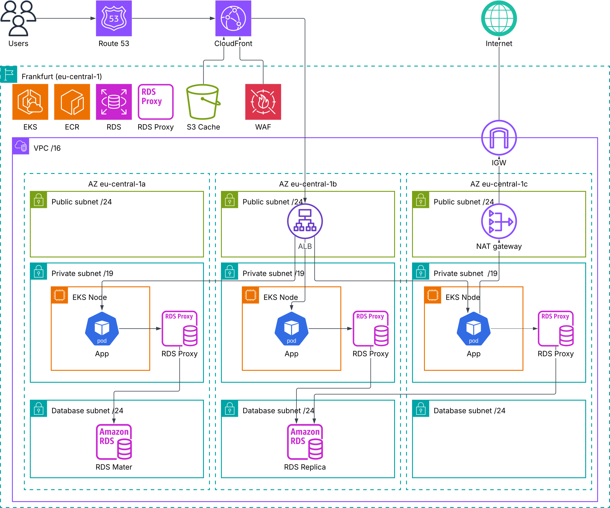

# Architecture Design for "Super Inc."

This document presents a collection of architectural decisions, rules, and guidelines that represent a synthesis of experience and recommendations from various sources.

This document is by no means intended to be perfect or suitable for all possible conditions or system variants. For example, low-latency systems may require simplification or alternative approaches for certain components. However, for the majority of standard applications (frontend + backend + mobile app), these guidelines should provide a solid foundation.

This document assumes AWS as the primary cloud provider. For GCP, the architecture (primarily the infrastructure surrounding Kubernetes) may differ in accordance with GCP-specific approaches and best practices.

## How to use this document

- **What this is**: A personal “playbook” of architectural decisions and operational guardrails that tend to work well for typical web systems (SPA + API + DB) on AWS.
- **What this is not**: A strict template or a one-size-fits-all solution. Treat it as a baseline and adjust to workload, budget, latency, compliance, and team maturity.

## Application Requirements

This is the starting point - we want to deploy the application, right? It must meet infrastructure expectations, and your developers should understand the ground rules.

The following describes the minimum requirements:

- Backend is fully managed through environment variables and follows The Twelve-Factor App practices - there's nothing more unproductive than trying to assemble a config file on the fly and put it in a ConfigMap using IaC tools
- Backend accepts database connection settings separately (DB_HOST, DB_PORT, etc.) - this allows storing passwords in a password management system and injecting them transparently into the process without parsing or replacing them in DB_URI
- Backend handles SIGTERM and supports graceful shutdown - this enables safe rolling updates and reduces blast radius during node termination events (including Spot)
- Backend must have proper health endpoints (`/livez` and `/readyz`)
- Backend must work correctly when multiple instances (pods) are running (either by selecting a leader or by symmetrically and evenly processing the load distributed across pods)
- Optionally, backend exposes important metrics at /metrics
- Frontend must be ready for CDN deployment, e.g., with all static files in one folder
- Frontend builder (webpack/vite) must use dynamic filename suffixes for proper cache invalidation. Yes, you should use a build tool and minify resources for production.

## Cloud Environment Structure

AWS strongly recommends distributing resources across accounts based on isolation and security boundaries. Additionally, this is convenient for billing and “blast radius” containment. The following structure can be proposed:

- **Management Account** - Contains:
  - Root user (not used for daily operations)
  - Billing role, OrganizationAdmin role(s), etc. - billing must be accessed from management account. No IAM users here (see Identity Account below)
- **Identity Account** - IAM users or IAM Identity Center should be placed here. Users assume roles in other accounts where permitted.
- **Shared Account** - Contains shared resources for staging and production environments. Can host the root DNS zone and optionally a shared ALB (not recommended, only for cost optimization)
- **Backup Account** - Stores backups including RDS snapshots via AWS Backup
- **Staging Account** - All staging environment resources
- **Production Account** - All production environment resources
- **Testing, Preprod, etc** - Additional environment accounts as needed for testing and pre-production workloads
- **Monitoring** - Centralized storage for logs and metrics. For cost optimization, all accounts can write logs and metrics here centrally.

If managing the lifecycle of other accounts via Terraform, the global S3 storage for Terraform state is located in the Management Account.

### KMS Key Management (Optional)

Use explicit KMS keys for encryption across all AWS services that support it, instead of default AWS-managed keys.

Key management practices:

- **Key location**: KMS keys can be stored in the Management Account if it contains minimal resources (as in our case)
- **CloudTrail**: Enable CloudTrail for the Management Account to audit all KMS key operations
- **Access control**: Implement two levels of access - Key administrators (manage key policies and settings) and Key users (use keys for encryption/decryption)
- **Key policy**: Key policy takes precedence over IAM policies - configure key policies carefully as the primary access control mechanism
- **Key scope**: One key per risk domain - create separate keys for different security boundaries (e.g., production vs staging, different applications)
- **Key rotation**: Enable automatic key rotation for all customer-managed keys
- **Key deletion**: Never delete KMS keys - schedule deletion only if absolutely necessary and after ensuring all encrypted data is migrated or no longer needed
- **Monitoring**: Set up alerts for critical KMS operations: `DisableKey`, `ScheduleKeyDeletion`, and any changes to key policies
- **Key aliases**: Add key aliases for visual convenience and easier key identification
- **Multi-Region keys**: If there's any possibility that RDS (or other databases) will become multi-regional (e.g., read replicas, standby instances, cross-region restores), create Multi-Region KMS keys from the start

### DNS Structure

When using a shared domain, each account gets its own DNS subzone. This approach provides isolation while maintaining a unified domain structure. The root DNS zone is hosted in the Shared Account, with NS records delegating subdomains to their respective accounts:

**Shared Account:**

- Route53 Hosted Zone: `superinc.com` (root zone)
  - NS records delegating `production.superinc.com` to production account
  - NS records delegating `staging.superinc.com` to staging account
  - Route53 alias records for apex (`@`) and `www` domains pointing to ALB/CloudFront (apex cannot be a CNAME record)
- Optional: Shared ALB (not recommended, only for cost optimization)

**Production Account:**

- Route53 Hosted Zone: `production.superinc.com`
- ALB / CloudFront / EKS ingress
- ACM certificates

**Staging Account:**

- Route53 Hosted Zone: `staging.superinc.com`
- Test infrastructure

## Network Design

  

### Design the Virtual Private Cloud (VPC) architecture

- **VPC structure**: One VPC per account - provides logical isolation and simplifies network management per environment
- **Public subnets**: Three small `/24` subnets (256 IPs each) deployed across multiple Availability Zones. These host minimal resources such as load balancers and NAT gateways
- **Private subnets**: Three large `/19` subnets (8,192 IPs each) deployed across Availability Zones. These host the majority of compute resources, including EKS worker nodes
- **Isolated subnets** (optional): Additional `/24` subnets for `database_subnets` (RDS, Aurora, and other database services), `elasticache_subnets` (ElastiCache clusters), and `intra_subnets` (internal-only resources that require no internet connectivity)
- **Internet Gateway (IGW)**: Attached to the VPC to provide internet connectivity. Public subnets route `0.0.0.0/0` traffic to the IGW
- **NAT Gateway**: Provides outbound internet access for private subnets. Can be deployed as a single NAT Gateway or per-AZ NAT Gateway . For non-production environments, consider using `fck-nat` as a cost-effective alternative
- **Isolated subnet routing**: Database, ElastiCache, and intra subnets have no default route to IGW or NAT Gateway. They only have routes for VPC-local traffic and VPC endpoints
- **Ingress entry points**: CloudFront serves as the primary entry point for SPA static assets, plus WAF on CloudFront. ALB handles API traffic with AWS WAF on ALB
- **VPC Endpoints**: Deploy VPC Endpoints (Gateway/Interface types) for commonly used AWS services to keep traffic within the AWS network and reduce NAT Gateway costs
- **EKS networking**: Use AWS VPC CNI in Prefix Delegation mode to efficiently allocate IP addresses and reduce IP exhaustion issues in large clusters

### Network Security

Network security follows the principle of least privilege and defense in depth. Key practices include:

- **Network segmentation**: Separate subnets into public and private, placing resources in private subnets whenever possible
- **Traffic ingress**: All incoming traffic must pass through a Load Balancer with WAF enabled
- **WAF placement**: Use WAF on Load Balancer or CloudFront - apply it as early as possible in the traffic flow to filter malicious requests before they reach your infrastructure
- **Traffic egress**: Outbound traffic from private subnets should only go through NAT, or be eliminated entirely if not needed. If a service doesn't need to work with external APIs, it shouldn't have internet access at all
- **Operator access**: Access to internal resources only through jumphost or VPN
- **IAM as single source of truth**: All operator access is managed through IAM / IAM Identity Center. Prefer temporary credentials and role assumption over static keys
- **EKS access**: Use AWS EKS access entries (or access entries + Kubernetes groups mapping) with `aws eks get-token`. Avoid long-lived kubeconfigs/tokens
- **Container registry**: Prefer AWS ECR. If you depend on upstream registries (Docker Hub, GHCR), consider ECR Pull-Through Cache rules to reduce rate-limit risk and improve reliability
- **Security Groups**: Apply Security Groups to everything. Use granular rules - avoid broad addresses (0.0.0.0/0) and port ranges (1-65535)
- **Security Groups for Pods (optional)**: Restrict network-level access for selected pods/services (e.g., DB access)
- **Private endpoints**: Create VPC endpoints for services within your VPC to avoid traffic going to public endpoints
- **Public access policy**: Public endpoints must be protected by WAF and TLS. Admin pages must be protected with BasicAuth or OAuth

## Compute Platform

### Kubernetes Deployment and Management

Use EKS as a managed control plane - no need to manage etcd/master nodes, updates and patches are handled by AWS.

- **Deployment approach**: Deploy everything through Kubernetes-native resources (Deployment/StatefulSet), isolate applications and users in their own namespaces. Use separate namespaces for different applications
- **Ingress**: Ingress is deprecated - use Gateway API alternatives instead
- **Traffic ingress**: ALB as the entry point into the cluster. We create it manually using IaC as opposed to the approach with AWS Load Balancer Controller and automatic LB creation. ACM certificates for HTTPS termination. Use TargetGroup (IP target mode) and TargetGroupBinding to connect to services inside the cluster
- **Internal traffic routing**: Traffic can go directly to application services, or use Traefik as a convenient layer for managing traffic within the cluster (IngressRoute, Middleware)
- **Configuration and secrets**: ConfigMap + Secrets (External Secrets Operator with AWS Secrets Manager/SSM)
- **External service access**: Use IRSA (or Pod Identity) for accessing external services
- **Network security**: If an application doesn't use AWS SDK (e.g., direct database access via PostgreSQL protocol), use Security Groups for Pods. Optionally use NetworkPolicies
- **Access control**: RBAC for internal user control

### Node Groups, Scaling, and Resource Allocation

Use Karpenter for node scaling and management.

- **Base node group**: Fixed minimal Managed Node Group for Karpenter controller and critical add-ons (CoreDNS, CNI components). Use taints to keep application workloads off this group; ensure required system pods have tolerations. All other application nodes are managed dynamically by Karpenter
- **Node pools**: Separate NodePools for different workloads and architectures (amd64/arm64). Mix of Spot and On-demand instances (not all applications can run on Spot instances)
- **Pod placement**: Use taints/tolerations + nodeSelector/affinity/antiAffinity for better placement control. Use topologySpreadConstraints for zone balancing
- **Availability**: PodDisruptionBudgets are mandatory to ensure service continuity
- **Horizontal scaling**: HPA is a key component. Scale based on memory/CPU or use external metrics like RPS through Prometheus adapter. VPA is rarely used and only for applications that cannot scale by pods (StatefulSet, legacy, singleton applications, jobs/cronjobs)
- **Resource requests and limits**: Applications must have properly configured requests and limits. AWS recommends setting `request.mem == limits.mem` and `requests.cpu`, but not setting `limits.cpu` so remaining node resources are used evenly
- **Resource quotas**: Use ResourceQuota and LimitRange in namespaces to prevent teams from consuming the entire cluster
- **Node lifecycle**: Enable gradual Karpenter consolidation/expiration

### Containerization Strategy

Container images should follow best practices for security, efficiency, and maintainability.

- **Dockerfile standards**:
  - Multi-stage build (build stage + runtime stage)
  - Minimal base image (distroless/alpine where appropriate). Combine commands to reduce the number of layers
  - Run as non-root user - use uid/gid/user
  - Health checks should be defined in Kubernetes manifests, not Dockerfile
  - For simplicity, use consistent ports across all containers for `/healthz` and `/metrics` endpoints
  - Default entry point and cmd
- **Build pipeline**:
  - Build images from any commit, or only from specified branches (main, prod, etc.)
  - The same image artifact should pass through testing and production environments
  - Tagging: semver+gitsha. Optionally include commit sequence number from git root in labels or tags - helps quickly identify version
- **Registry**:
  - AWS ECR as the primary registry, with lifecycle policies for cleaning up old tags
  - Enable ECR vulnerability scanning
- **Deployment process**:
  - Rolling update (default deployment behavior) or canary/blue-green with Argo Rollouts
  - Direct deployment (pipeline connects to cluster and updates image tag) or gitops-like strategy (pipeline generates new commit in GitOps repository which stores values.yaml for ArgoCD, ArgoCD picks up changes and updates running pods)
  - For GitOps repository, use universal Helm templates that include all features: Deployment, Volumes, StatefulSet, Secrets, ConfigMaps, etc.

## Database

TODO
